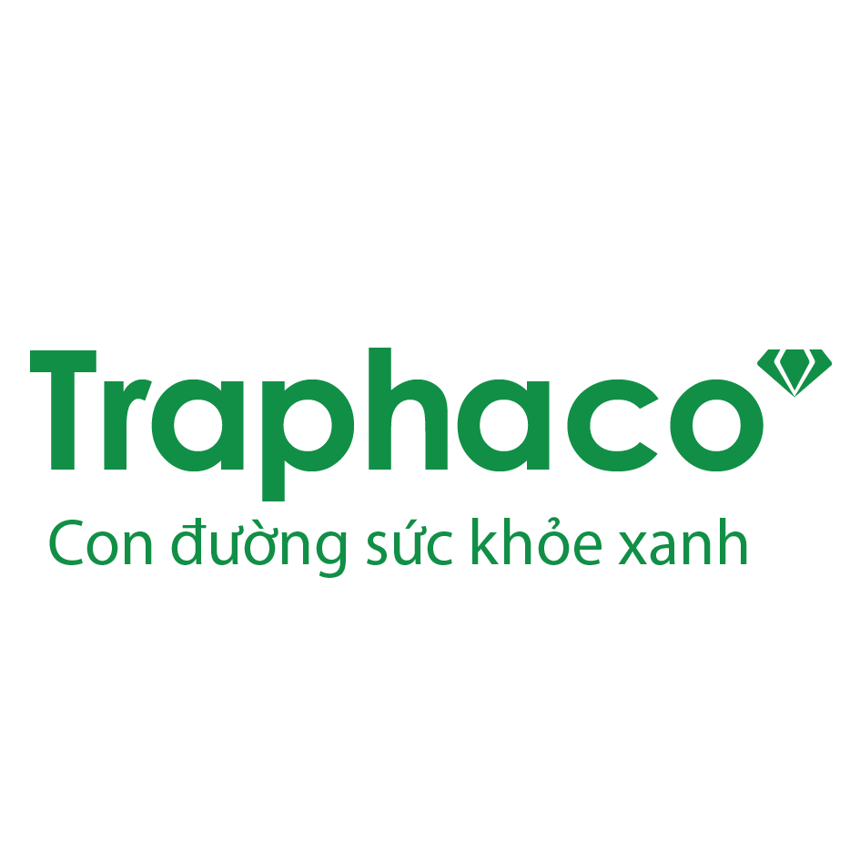

# 💻 IT Department – Traphaco JSC

Welcome to the official GitHub profile of the **Information Technology Department** of **Traphaco JSC**, a pioneering Vietnamese pharmaceutical company known for its commitment to natural healthcare products and sustainable development.

---

## 🏢 About Us

  

The IT Department at Traphaco is dedicated to building and maintaining innovative digital infrastructure and solutions that empower our employees, optimize operations, and support the company’s mission of bringing high-quality pharmaceutical products to the people of Vietnam and beyond.

---

## 🌐 What We Do

- 💼 **Enterprise Systems** – Develop and maintain ERP, CRM, and internal management tools.
- 🔒 **Cybersecurity** – Ensure the security and integrity of company data and IT assets.
- ☁️ **Cloud & Infrastructure** – Manage hybrid cloud environments and on-premise infrastructure.
- 🛠️ **Support & Maintenance** – Provide technical support and training for over 1,000 employees.
- 📊 **Data & Analytics** – Build tools and reports for better data-driven decisions.

---

## 🚀 Our Mission

> "To leverage technology in driving innovation, efficiency, and sustainable growth for Traphaco."

---

## 🧠 Tech Stack

We use a wide range of modern technologies:

- **Languages**: Python, JavaScript, SQL, C#
- **Frameworks**: React, .NET, Node.js
- **Tools**: Git, Docker, Jenkins, Power BI
- **Platforms**: Azure, Windows Server, Microsoft 365, PostgreSQL, Oracle

---

## 📂 Key Repositories

We are working on internal tools and contributions to automation and process improvement. Some projects may be private due to corporate policies.

- 📁 `erp-integrations` – Scripts and services for ERP automation
- 📁 `it-assets-tracker` – Tool to track and manage company IT assets
- 📁 `support-bot` – Internal chatbot to help employees with IT support

---

## 📫 Contact Us

> **Email**: it@traphaco.com.vn  
> **Phone**: (+84) 24 3753 3555  
> **Website**: [www.traphaco.com.vn](https://traphaco.com.vn/)

---

## 🤝 Collaborate With Us

We welcome collaboration on open-source projects, internships, and IT innovation initiatives. Get in touch to learn more!

---

_This GitHub profile is maintained by the Traphaco IT Department._